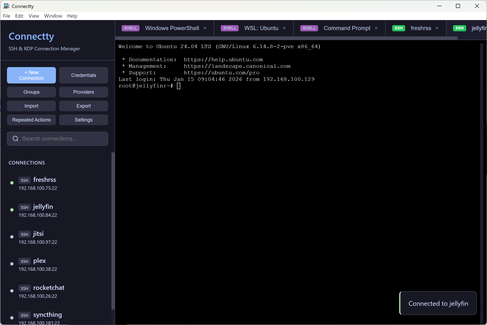
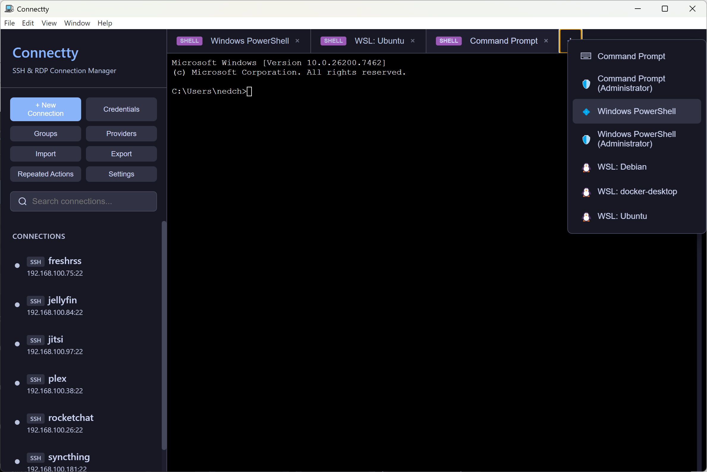
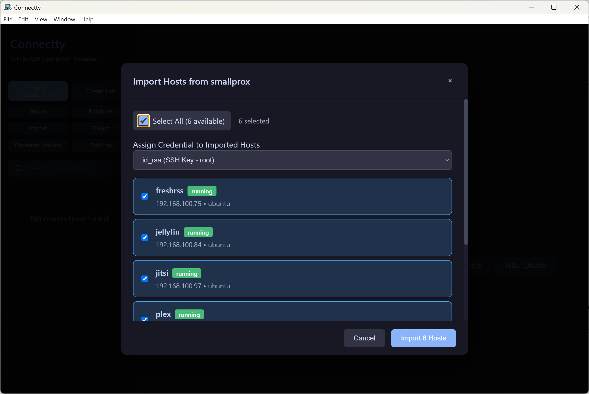
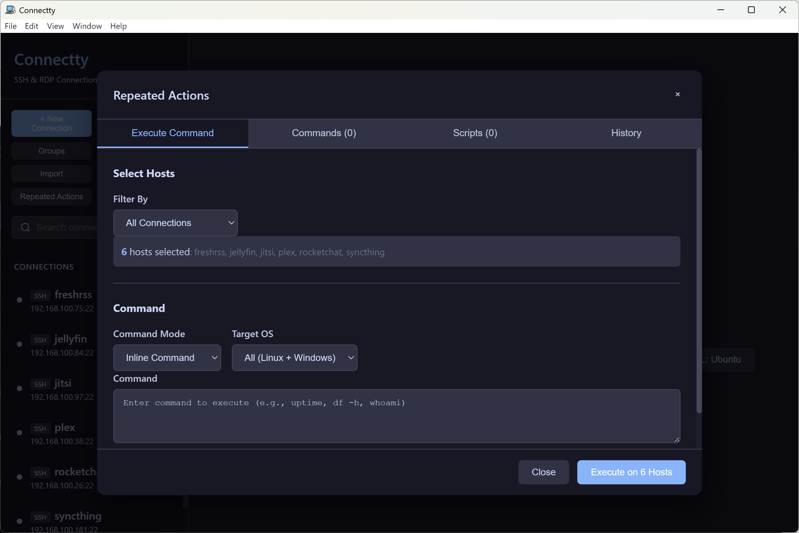
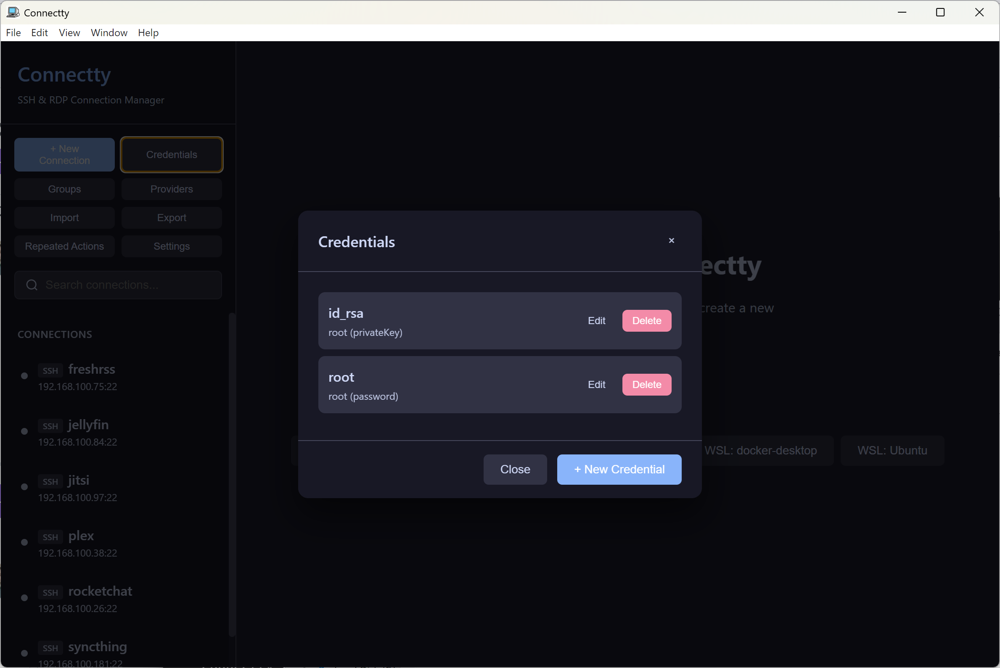
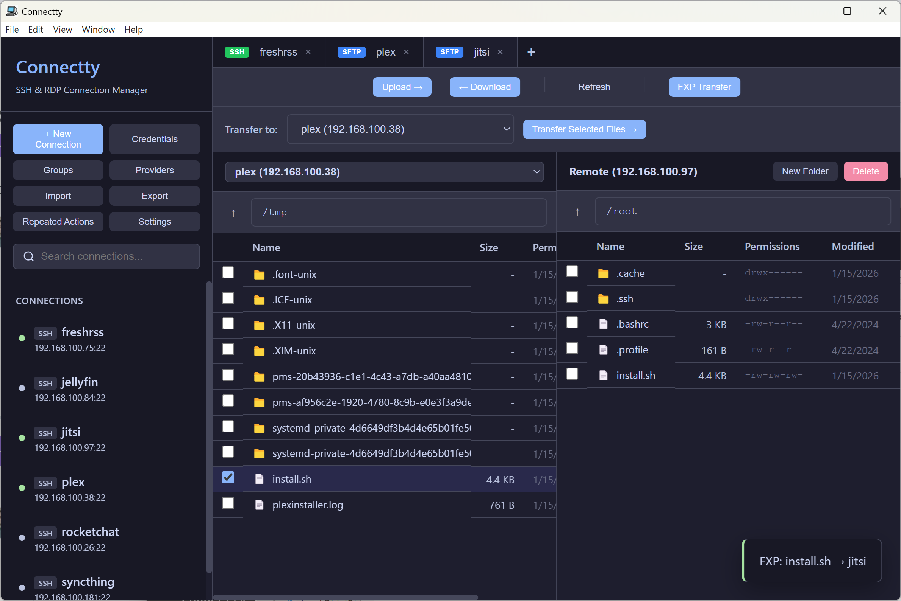
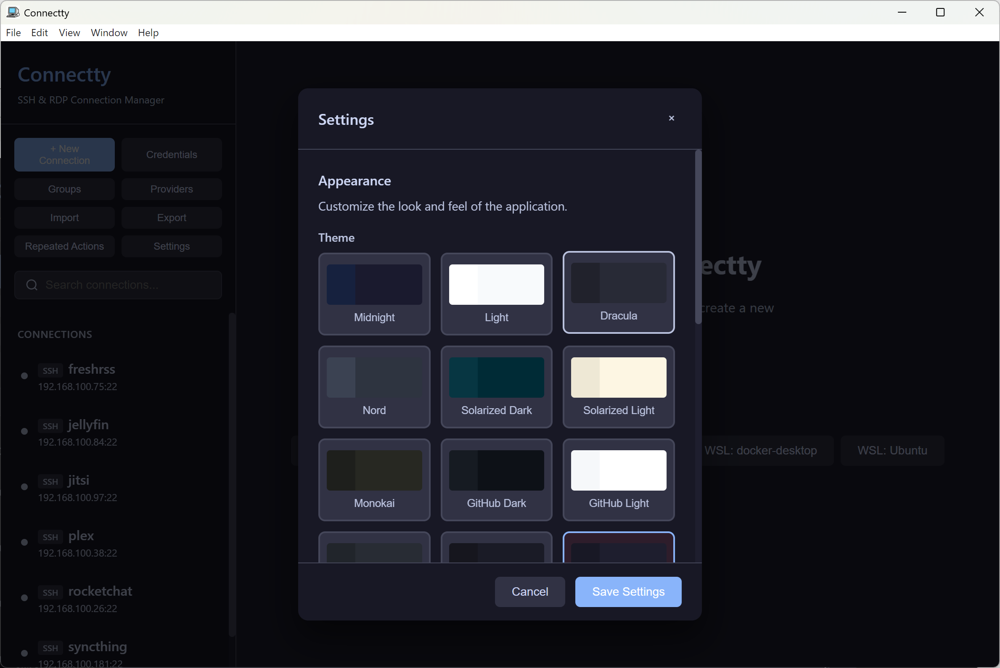
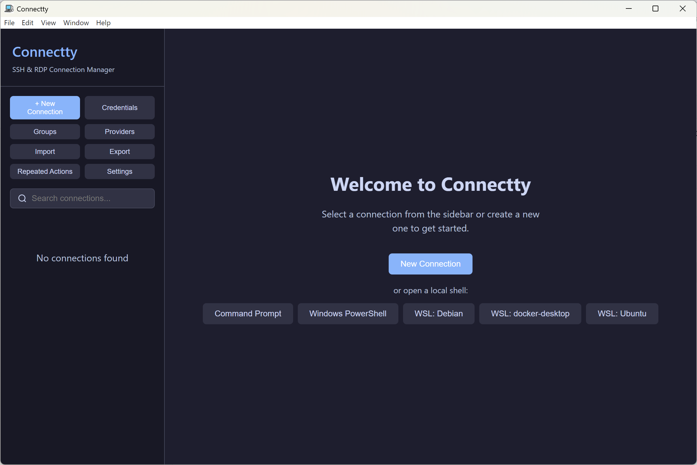

# Connectty

<div align="center">

**The Modern Connection Manager for DevOps & SysAdmins**

[](../../releases)
[](LICENSE)
[](https://nodejs.org)

[Features](#features) • [Comparison](#comparison) • [Quick Start](#quick-start) • [Documentation](#documentation)



</div>

---

## Why Connectty?

Managing dozens (or hundreds) of servers shouldn't mean juggling SSH configs, RDP files, and spreadsheets. Connectty brings everything together in one powerful interface with cloud provider integration, bulk command execution, and secure credential management.

**Key Differentiators:**
- **Cloud-native discovery** - Auto-import servers from VMware, Proxmox, AWS, Azure, GCP, BigFix
- **Bulk command execution** - Run commands across hundreds of servers simultaneously
- **Unified interface** - SSH, RDP, Serial, SFTP, and local shells in tabbed sessions
- **Free & open source** - No subscriptions, no seat licenses, no feature gates

---

## Comparison

| Feature | Connectty | Termius | SecureCRT | PuTTY | MobaXterm |
|:--------|:---------:|:-------:|:---------:|:-----:|:---------:|
| **Pricing** | Free | $10/mo+ | $119+ | Free | Free/$70 |
| **Open Source** | Yes | No | No | Yes | No |
| **SSH / RDP / Serial** | All | SSH only | SSH+Serial | SSH+Serial | All |
| **Cloud Discovery** | 6 providers | No | No | No | No |
| **Bulk Commands** | Yes | No | No | No | Pro only |
| **Credential Vault** | Encrypted | Encrypted | Yes | No | Yes |

[See full comparison →](docs/FEATURES.md#comparison-with-other-clients)

---

## Features

### Multi-Protocol Support

Connect to anything: SSH, RDP, Serial/COM, SFTP, and local shells—all in one tabbed interface.



| Protocol | Features |
|:---------|:---------|
| **SSH** | 256-color, mouse support, agent forwarding, key auth |
| **RDP** | Embedded canvas sessions + native client fallback |
| **Serial** | Baud 300-921600, all parity/flow options |
| **SFTP** | Dual-pane browser with FXP site-to-site transfer |
| **Local Shell** | cmd, PowerShell, bash, zsh, fish, WSL distros |

---

### Cloud Provider Discovery

Auto-discover and import servers from your infrastructure.




| Provider | Features |
|:---------|:---------|
| **VMware vSphere** | VMs from vCenter/ESXi, VMware Tools IP, tags |
| **Proxmox VE** | QEMU VMs + LXC containers, guest agent IP |
| **AWS EC2** | Multi-region, public/private IPs, tags |
| **Google Cloud** | Compute Engine, zones, service account auth |
| **Microsoft Azure** | VMs, resource groups, service principal |
| **IBM BigFix** | Managed endpoints, AD auth, online status |

---

### Bulk Command Execution

Run commands across your entire fleet with parallel execution.



- **Target by group, pattern, or manual selection**
- **Parallel execution** across up to 10 hosts
- **Saved commands & scripts** with categories
- **Real-time output** streaming per host

---

### Credential Management

Secure, organized credential storage with smart auto-assignment.



- **AES-256-GCM encryption** with per-installation key
- **Auto-assign by OS type** (Linux/Windows) or hostname pattern
- **Support for** password, SSH key, SSH agent, domain creds

---

### SFTP with FXP Transfer

Dual-pane file browser with site-to-site transfer support.



- **Upload/download** with progress tracking
- **FXP transfer** between two remote servers
- **File operations**: mkdir, delete, rename, chmod

---

### Import & Export

Migrate from other tools or backup your data.

| Format | Import | Export |
|:-------|:------:|:------:|
| **JSON** | Yes | Yes |
| **CSV** | Yes | Yes |
| **SSH Config** | Yes | - |
| **PuTTY** | Yes | - |

---

### 18 Built-in Themes



Dracula, Nord, Tokyo Night, Catppuccin, Gruvbox, Solarized, and more.

---

### Welcome Screen

Quick access to local shells and recent connections on startup.



---

## Quick Start

### Desktop App

```bash
# Clone and install
git clone https://github.com/your-org/connectty.git
cd connectty
npm install

# Build shared package first
npm run build -w @connectty/shared

# Run desktop app
npm run start -w @connectty/desktop
```

### Docker (Server + Web)

```bash
# Configure environment
cp .env.example .env
nano .env  # Set JWT_SECRET and DB_PASSWORD

# Launch
docker-compose up -d

# Access at http://localhost:8080
```

---

## Installation

### Pre-built Binaries

Download from [Releases](../../releases):

| Platform | Package |
|:---------|:--------|
| **Windows** | `Connectty-Setup-x.x.x.exe` |
| **Debian/Ubuntu** | `connectty_x.x.x_amd64.deb` |
| **Other Linux** | `connectty-x.x.x.AppImage` |
| **macOS** | `Connectty-x.x.x.dmg` |

### Build from Source

```bash
npm run dist:win -w @connectty/desktop    # Windows
npm run dist:linux -w @connectty/desktop  # Linux
npm run dist:mac -w @connectty/desktop    # macOS
```

---

## Documentation

| Document | Description |
|:---------|:------------|
| [Features Guide](docs/FEATURES.md) | Full feature comparison and details |
| [Provider Setup](docs/PROVIDERS.md) | Cloud provider configuration |
| [Configuration](docs/CONFIGURATION.md) | Environment variables, Docker |
| [API Reference](docs/API.md) | REST endpoints, WebSocket events |

---

## Security

| Feature | Implementation |
|:--------|:---------------|
| **Credential Encryption** | AES-256-GCM with per-installation key |
| **Key Storage** | Private keys stored encrypted |
| **SSH Security** | Key auth, agent forwarding |
| **Provider Auth** | API tokens, service accounts |

---

## Contributing

1. Fork the repository
2. Create a feature branch: `git checkout -b feature/amazing`
3. Make your changes with tests
4. Commit: `git commit -m 'Add amazing feature'`
5. Push: `git push origin feature/amazing`
6. Open a Pull Request

---

## License

MIT License - see [LICENSE](LICENSE) for details.

---

<div align="center">

**[Report Bug](../../issues) · [Request Feature](../../issues) · [Discussions](../../discussions)**

Built with Electron, React, and xterm.js

</div>
