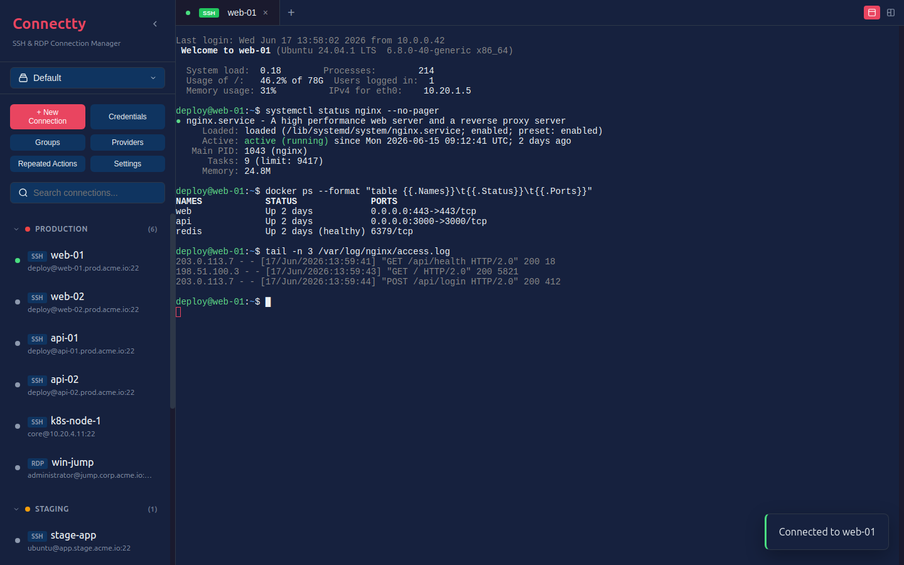
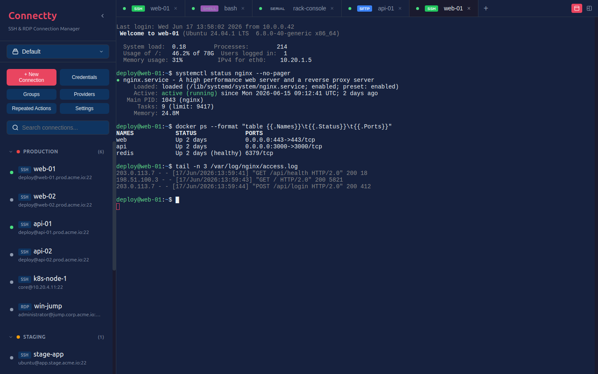
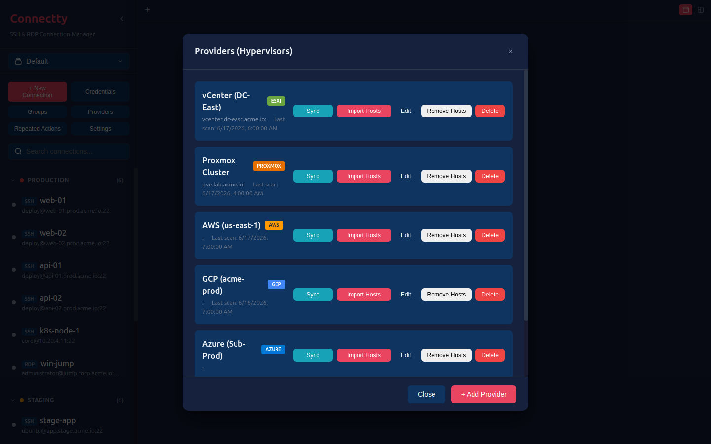
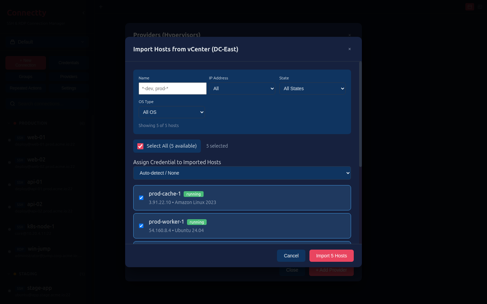
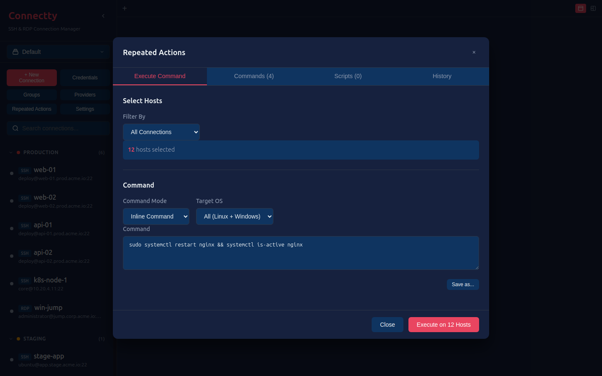
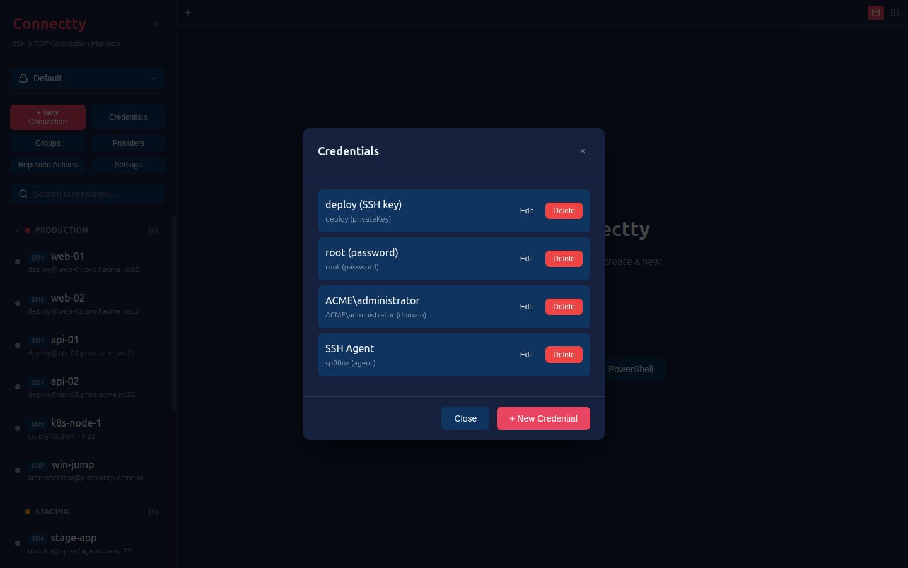
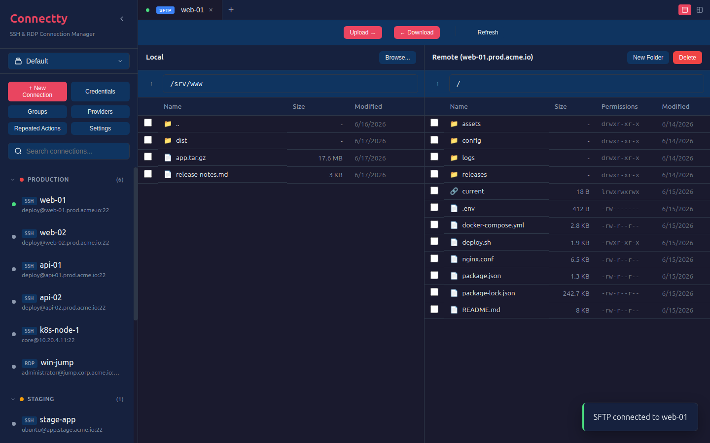
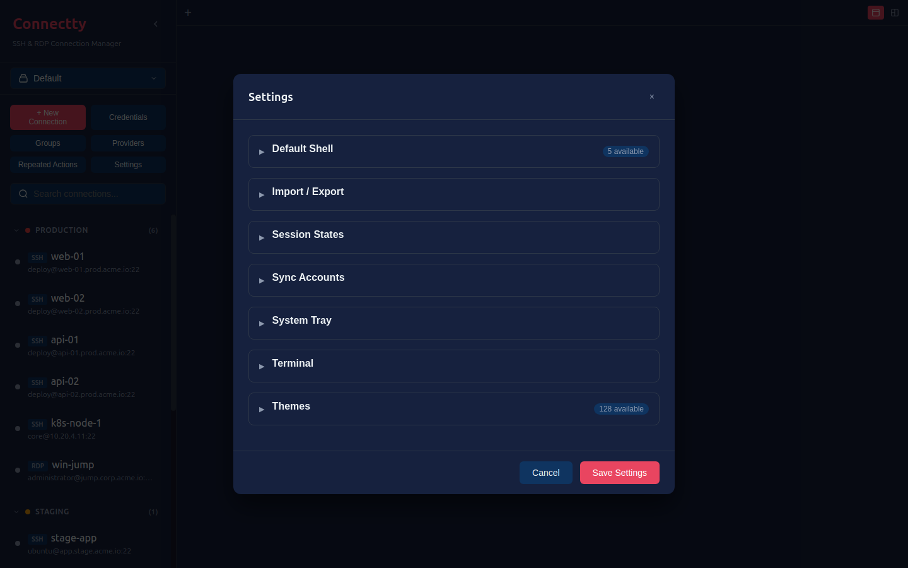

# Connectty

<div align="center">

**The Modern Connection Manager for DevOps & SysAdmins**

[](https://sp00.nz/releases/connectty/)
[](https://sp00.nz/releases/connectty/)
[](LICENSE)

[Features](#features) • [Comparison](#comparison) • [Quick Start](#quick-start) • [Documentation](#documentation)



</div>

---

## Why Connectty?

Managing dozens (or hundreds) of servers shouldn't mean juggling SSH configs, RDP files, and spreadsheets. Connectty brings everything together in one powerful interface with cloud provider integration, bulk command execution, and secure credential management.

**Key Differentiators:**
- **Native performance** - Built with Tauri 2 (Rust + WebView2), sub-second startup, ~5MB binary
- **Tmux-like paneling** - Split terminals into flexible layouts up to 4x4, with preset and custom tiling
- **Cloud-native discovery** - Auto-import servers from VMware, Proxmox, AWS, Azure, GCP, BigFix
- **Bulk command execution** - Run commands across hundreds of servers simultaneously
- **Unified interface** - SSH, RDP, Serial, SFTP, and local shells in tabbed or paneled sessions
- **AI session monitoring** - Track local Claude Code & Copilot CLI sessions, grouped by project, with cross-session prompt search
- **Command palette** - VS Code-style `Ctrl+Shift+K` launcher for every action
- **Free & open source** - No subscriptions, no seat licenses, no feature gates

> **Note:** The web client provides SSH terminal access for teams. Full features (RDP, Serial, SFTP, Providers, Bulk Commands) require the desktop app.

---

## What's New in v2.0

- **Native desktop app** - Migrated from Electron to Tauri 2 (Rust backend, OS-native WebView). Startup is near-instant vs the multi-second Electron cold start.
- **Terminal paneling** - Tmux-style split panes with draggable dividers, 9 preset layouts (single through 4x4), keyboard shortcuts for splitting/navigating/closing panes.
- **Collapsible sidebar** - `Ctrl+B` toggles the connection list between full and icon-only mode for maximum terminal space.
- **Cross-platform native** - Windows (WebView2), macOS (WKWebView), Linux (WebKitGTK). Each platform uses its OS-native web renderer.
- **Command palette** - `Ctrl+Shift+K` opens a fuzzy launcher for connections, shells, layouts, and every app action.
- **AI session monitoring** - A side panel (`Ctrl+Shift+A`) that tracks running Claude Code and Copilot CLI sessions, grouped by project, with one-click resume/spawn and cross-session prompt search (`Ctrl+Shift+Y`).
- **Tab groups & undo-close** - Colored, collapsible tab groups, plus `Ctrl+Shift+Z` to reopen a closed session and saved named pane layouts.

---

## Comparison

| Feature | Connectty | Termius | SecureCRT | PuTTY | MobaXterm |
|:--------|:---------:|:-------:|:---------:|:-----:|:---------:|
| **Pricing** | Free | $10/mo+ | $119+ | Free | Free/$70 |
| **Open Source** | Yes | No | No | Yes | No |
| **Native App** | Tauri/Rust | Electron | Native | Native | Native |
| **SSH / RDP / Serial** | All | SSH only | SSH+Serial | SSH+Serial | All |
| **Terminal Paneling** | Yes | No | No | No | Pro only |
| **Cloud Discovery** | 6 providers | No | No | No | No |
| **Bulk Commands** | Yes | No | No | No | Pro only |
| **Credential Vault** | Encrypted | Encrypted | Yes | No | Yes |

---

## Features

### Multi-Protocol Support

Connect to anything: SSH, RDP, Serial/COM, SFTP, and local shells—all in one tabbed interface.



| Protocol | Features |
|:---------|:---------|
| **SSH** | 256-color, mouse support, agent forwarding, key auth |
| **RDP** | Embedded canvas sessions + native client fallback |
| **Serial** | Baud 300-921600, all parity/flow options |
| **SFTP** | Dual-pane browser with FXP site-to-site transfer |
| **Local Shell** | cmd, PowerShell, bash, zsh, fish, WSL distros |

---

### Terminal Paneling

Split your terminal into flexible layouts with tmux-style paneling.

- **9 preset layouts** - Single, side-by-side, 2x2, 1+2, 2+1, 3-column, 3x3, 4x4 (`Ctrl+Shift+P` to pick)
- **Custom splits** - Split any pane horizontally or vertically
- **Draggable dividers** - Resize panes by dragging
- **Named layouts** - Save the current split topology and reload it later, repopulating panes with open sessions
- **Keyboard driven** - `Ctrl+Shift+|` split vertical, `Ctrl+Shift+-` split horizontal, `Ctrl+Shift+Arrow` navigate

Toggle between classic tab mode and panel mode with `Ctrl+Shift+T`. Reopen an accidentally closed session with `Ctrl+Shift+Z` (last 10 closes are remembered). Every tab and pane shows a live **status dot** — green when connected, red on a transport error.

---

### Command Palette

A VS Code-style fuzzy launcher, opened with `Ctrl+Shift+K`.

- **One shortcut for everything** - New connection/credential/group/provider, bulk commands, settings, layouts, AI panels
- **Quick connect** - Jump straight to any saved connection or open an SFTP session to it
- **Shell picker** - Launch any detected local shell (bash, zsh, fish, PowerShell, cmd, WSL distros)
- **Full keyboard nav** - Arrow keys to move, Enter to run, Esc to dismiss

---

### Tab Groups

Organize busy sessions into named, colored groups.

- **Colored grouping** - Auto-assigned color palette, created from the tab right-click menu
- **Collapsible** - Click a group header to fold its tabs away and reclaim tab-bar space
- **Member counts** - Each group header shows how many sessions it holds

---

### AI Session Monitoring

Track your local AI coding sessions alongside your terminals. Toggle the panel with `Ctrl+Shift+A`.

- **Claude Code & Copilot** - Auto-detects sessions from `~/.claude` and `~/.copilot` logs, with an All/Claude/Copilot filter
- **Grouped by project** - Sessions are organized by project, showing title, git branch, message/tool counts, and last prompt
- **Live status** - A filesystem watcher marks sessions active or idle in real time
- **Spawn & resume** - Start a fresh agent in a project's directory, or resume any past session in a local shell
- **Cross-session prompt search** - `Ctrl+Shift+Y` searches your prompt history across every session; click a result to resume it

---

### Cloud Provider Discovery

Auto-discover and import servers from your infrastructure.




| Provider | Features |
|:---------|:---------|
| **VMware vSphere** | VMs from vCenter/ESXi, VMware Tools IP, tags |
| **Proxmox VE** | QEMU VMs + LXC containers, guest agent IP |
| **AWS EC2** | Multi-region, public/private IPs, tags |
| **Google Cloud** | Compute Engine, zones, service account auth |
| **Microsoft Azure** | VMs, resource groups, service principal |
| **IBM BigFix** | Managed endpoints, AD auth, online status |

---

### Bulk Command Execution

Run commands across your entire fleet with parallel execution.



- **Target by group, pattern, or manual selection**
- **Parallel execution** across up to 10 hosts
- **Saved commands & scripts** with categories
- **Real-time output** streaming per host

---

### Credential Management

Secure, organized credential storage with smart auto-assignment.



- **AES-256-GCM encryption** with per-installation key
- **Auto-assign by OS type** (Linux/Windows) or hostname pattern
- **Support for** password, SSH key, SSH agent, domain creds

---

### SFTP with FXP Transfer

Dual-pane file browser with site-to-site transfer support.



- **Upload/download** with progress tracking
- **FXP transfer** between two remote servers
- **File operations**: mkdir, delete, rename, chmod

---

### Import & Export

Migrate from other tools or backup your data.

| Format | Import | Export |
|:-------|:------:|:------:|
| **JSON** | Yes | Yes |
| **CSV** | Yes | Yes |
| **SSH Config** | Yes | - |
| **PuTTY** | Yes | - |

---

### 100+ Built-in Themes



Choose from over 100 themes including Dracula, Nord, Tokyo Night, Catppuccin, Gruvbox, Solarized, Synthwave, and many more.

---

## Keyboard Shortcuts

| Shortcut | Action |
|:---------|:-------|
| `Ctrl+Shift+K` | Open command palette |
| `Ctrl+B` | Toggle sidebar (full / icon-only) |
| `Ctrl+Shift+T` | Toggle panel (paneling) mode |
| `Ctrl+Shift+P` | Choose pane layout |
| `Ctrl+Shift+\|` | Split pane vertically |
| `Ctrl+Shift+-` | Split pane horizontally |
| `Ctrl+Shift+Arrow` | Navigate between panes |
| `Ctrl+Shift+Z` | Reopen last closed session |
| `Ctrl+Shift+A` | Toggle AI sessions panel |
| `Ctrl+Shift+Y` | Search AI prompts across sessions |

---

## Quick Start

### Desktop App (Tauri - Recommended)

Requires [Rust](https://rustup.rs/) and [Node.js](https://nodejs.org/).

```bash
# Clone and install
git clone https://github.com/sp00nznet/connectty.git
cd connectty
npm install

# Build shared package
npm run build -w @connectty/shared

# Run native desktop app
cd packages/tauri
cargo tauri dev
```

### Desktop App (Electron - Legacy)

```bash
npm run build -w @connectty/shared
npm run start -w @connectty/desktop
```

### Docker (Server + Web)

```bash
# Configure environment
cp .env.example .env
nano .env  # Set JWT_SECRET and DB_PASSWORD

# Launch
docker-compose up -d

# Access at http://localhost:8080
```

---

## Installation

### Pre-built Binaries

Download from [Releases](https://sp00.nz/releases/connectty/):

| Platform | Package |
|:---------|:--------|
| **Windows** | `Connectty-Setup-x.x.x.exe` |
| **Debian/Ubuntu** | `connectty_x.x.x_amd64.deb` |
| **Other Linux** | `connectty-x.x.x.AppImage` |
| **macOS** | `Connectty-x.x.x.dmg` |

### Build from Source

```bash
# Tauri (native)
cd packages/tauri
cargo tauri build

# Electron (legacy)
npm run dist:win -w @connectty/desktop    # Windows
npm run dist:linux -w @connectty/desktop  # Linux
npm run dist:mac -w @connectty/desktop    # macOS
```

---

## Architecture

Connectty is a monorepo with four packages:

| Package | Technology | Purpose |
|:--------|:-----------|:--------|
| `packages/tauri` | Rust + Tauri 2 | Native desktop app (primary) |
| `packages/desktop` | Electron + React | Legacy desktop app |
| `packages/server` | Express + PostgreSQL | Web backend + API |
| `packages/web` | React + xterm.js | Web SSH client |
| `packages/shared` | TypeScript | Shared types & utilities |

The Tauri app uses an adapter pattern (`connectty-api.ts`) that maps the same `window.connectty` interface to Tauri's `invoke()`/`listen()` API, allowing the React frontend to work unchanged across both Electron and Tauri shells.

---

## Documentation

| Document | Description |
|:---------|:------------|
| [Features Guide](docs/FEATURES.md) | Full feature comparison and details |
| [Provider Setup](docs/PROVIDERS.md) | Cloud provider configuration |
| [Configuration](docs/CONFIGURATION.md) | Environment variables, Docker |
| [API Reference](docs/API.md) | REST endpoints, WebSocket events |

---

## Security

| Feature | Implementation |
|:--------|:---------------|
| **Credential Encryption** | AES-256-GCM with per-installation key |
| **Key Storage** | Private keys stored encrypted |
| **SSH Security** | Key auth, agent forwarding |
| **Provider Auth** | API tokens, service accounts |

---

## Contributing

1. Fork the repository
2. Create a feature branch: `git checkout -b feature/amazing`
3. Make your changes with tests
4. Commit: `git commit -m 'Add amazing feature'`
5. Push: `git push origin feature/amazing`
6. Open a Pull Request

---

## License

MIT License - see [LICENSE](LICENSE) for details.

---

<div align="center">

**[Report Bug](../../issues) · [Request Feature](../../issues) · [Discussions](../../discussions)**

Built with Tauri, Rust, React, and xterm.js

</div>
